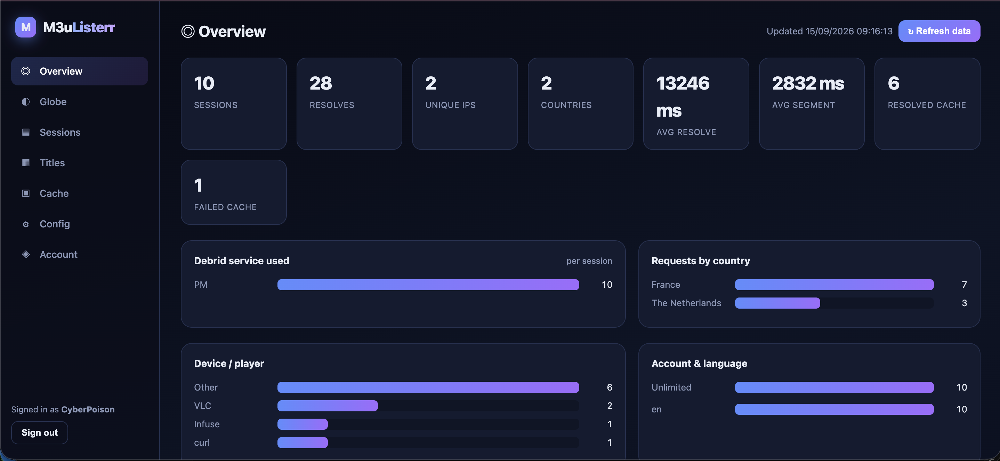
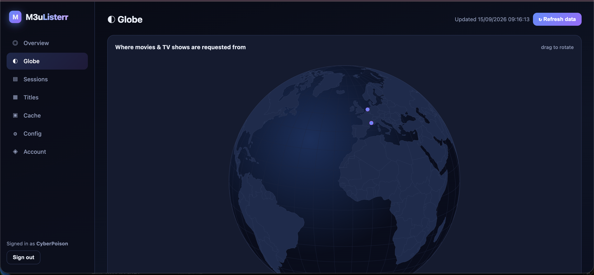
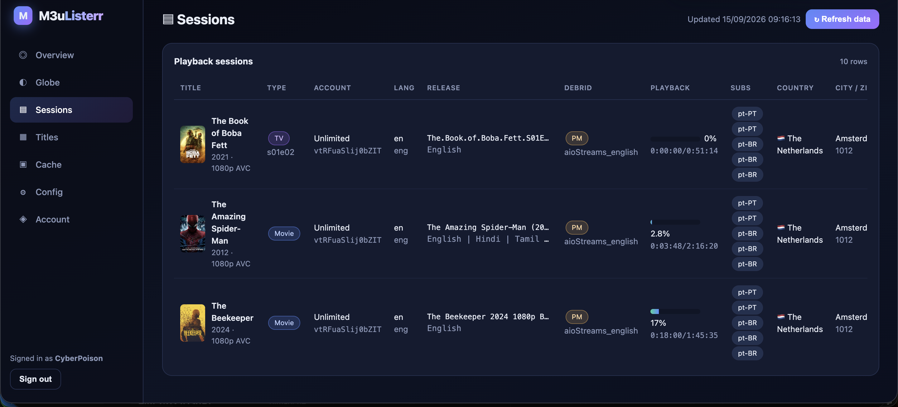
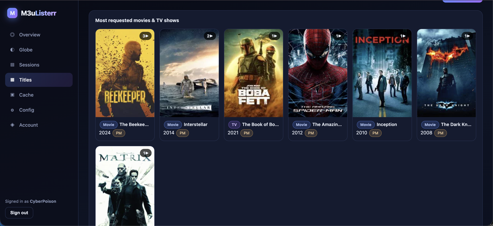

# 🎬 TMDB in VOD: TV in Diretta, Film & Serie Gratis [Xtream Codes & M3U8]

[🇺🇸 English](README.md) | [🇮🇹 Italiano](README_IT.md)

[](https://github.com/CyberPoison/m3ulisterr/actions/workflows/ci.yml)
[](https://ghcr.io/cyberpoison/m3ulisterr:latest)
[](https://github.com/CyberPoison/m3ulisterr/archive/refs/tags/latest.zip)
[](https://ko-fi.com/gogetta69)

---

## 📝 Riepilogo

Crea Playlist Video on Demand (VOD) di TV in Diretta, Film e Serie TV utilizzando il formato **Xtream Codes** o **M3U8**.

Genera playlist dinamiche per TV in Diretta, Film e Serie TV utilizzando una versione simulata di Xtream Codes. Crea playlist IPTV, di film e serie con metadati completi. Link di streaming individuati utilizzando TMDB, Real-Debrid, Premiumize e Fonti Dirette. Ideale per l'uso con app come iMplayer, Tivimate, IPTV Streamers Pro, XCIPTV Player e altre.

---

## 🎥 Video Dimostrativo

<div align="center">
  
</div>

---

## 📸 Screenshot

<table style="border-collapse: collapse; border: none; margin: 0 auto;">
  <tr>
    <td align="center"></td>
    <td align="center"></td>
    <td align="center"></td>
  </tr>
  <tr>
    <td align="center"></td>
    <td align="center"></td>
    <td align="center"></td>
  </tr>
  <tr>
    <td align="center"></td>
    <td align="center"></td>
    <td align="center"></td>
  </tr>
  <tr>
    <td align="center" colspan="3"></td>
  </tr>
</table>

---

## ✨ Funzionalità

- **Generazione Dinamica:** Crea playlist on-demand per TV in diretta, film e serie TV.
- **Integrazione Avanzata:** Supporto per TMDB, Real Debrid, Premiumize e fonti dirette per un recupero avanzato dei contenuti.
- **Emulazione Xtream Codes:** Perfetta emulazione del software Xtream Codes per dettagli completi sui metadati.
- **TV in Diretta:** Include fonti di TV in Diretta come [Daddylive](https://href.li/?https://dlhd.so/24-7-channels.php), [TheTVApp](https://href.li/?https://thetvapp.to/), [MoveOnJoy](https://i.imgur.com/dFazdys.png), [Streamed Su Sports](https://href.li/?https://streamed.pk/), [Pluto TV](https://href.li/?https://downloads.pluto.tv/docs/pluto_tv_channels_listing.pdf) e altre.
- **Guida TV:** La maggior parte dei canali TV in diretta include informazioni dettagliate sulla Guida TV (EPG).
- **Cache Intelligente:** Memorizzazione nella cache automatica dei link di streaming trovati per una riproduzione efficiente e rapida.
- **VOD per Adulti:** 10.000 film interi per adulti aggiunti al VOD (disabilitato per impostazione predefinita).
- **Audio Intelligente:** Selezione dell'audio nella lingua corretta per le release multi-audio (legge l'intestazione del file, non solo il tag M3U).
- **Percorso Francese Dedicato:** (`UnlimitedFR` / `?lang=fr`) con audio francese verificato nell'intestazione e una scala di qualità che privilegia la cache.
- **Sottotitoli Internazionali:** Tracce di sottotitoli in portoghese europeo (pt-PT) e brasiliano (pt-BR), con un fallback diretto all'API di OpenSubtitles.
- **Dashboard Analitica M3uListerr:** Statistiche di riproduzione, un globo interattivo, grafici e una tabella dettagliata per singola sessione.

---

## 🚀 Per Iniziare

[](https://rumble.com/embed/v54v3nx/?pub=4)

1. **⚙️ Configurazione**: Inizia configurando lo script con la [TMDB API Key](https://developer.themoviedb.org/docs/getting-started) gratuita richiesta e una chiave privata opzionale per [Real Debrid](https://real-debrid.com/apitoken) o [Premiumize](https://www.premiumize.me/account), che non sono obbligatorie.
2. **🔗 Integrazione Xtream Codes**: Inserisci l'indirizzo IP o il dominio come server Xtream Codes all'interno della tua app. Qualsiasi nome utente e password funzionerà poiché lo script non richiede l'autenticazione. Questo caricherà automaticamente le playlist di TV in Diretta, Film e Serie TV.
3. **📺 App non compatibili con Xtream Codes**: Se la tua app non supporta Xtream Codes, carica `http://INDIRIZZO_IP/player_api.php?action=get_vod_streams` (sostituisci `INDIRIZZO_IP` con l'indirizzo ip del tuo computer) nel tuo browser, quindi individua la `playlist.m3u8` generata nella stessa cartella e caricala come playlist M3U. Nota che le playlist M3U8 sono disponibili solo per i film e la TV in diretta; le serie TV non possono essere caricate come playlist M3U.
4. **▶️ Riproduzione**: Una volta configurato tutto e caricate le playlist, potrai riprodurre i contenuti. Facendo clic su play, lo script inizierà a cercare un link funzionante su più siti Web in background. Ti preghiamo di avere pazienza; una volta trovato, il link viene memorizzato nella cache per circa 3 ore (allineandosi con la scadenza tipica dei token dei provider).
5. **💻 Hosting Locale**: Se non disponi di un web server remoto, puoi installare ed eseguire questo script leggero sul tuo computer tramite software come [XAMPP](https://www.apachefriends.org/it/index.html).

---

## 🤖 Cos'è HeadlessVidX?

**HeadlessVidX** è uno strumento progettato per semplificare lo sviluppo di estrattori video per siti Web di streaming. Offre una soluzione facile da usare per gli utenti, indipendentemente dalle loro competenze di programmazione, per aggiungere rapidamente siti di streaming video a strumenti come 'TMDB TO VOD'.

<table style="border-collapse: collapse; border: none; margin: 0 auto;">
  <tr>
    <td align="center"></td>
    <td align="center"></td>
  </tr>
</table>

---

## 📑 Creazione della Playlist

Non è più necessario eseguire manualmente `create_playlist.php` e `create_tv_playlist.php`. Con il flusso di lavoro di GitHub Actions già configurato, queste playlist vengono generate automaticamente due volte al giorno. Per abilitare la creazione delle tue playlist di film e serie, imposta semplicemente `$userCreatePlaylist = true;` nel file `config.php`.

https://github.com/user-attachments/assets/c6af6149-c170-45fc-a6ac-32edd1b3405b

---

## 🐳 Distribuzione Docker

Ora puoi eseguire l'intero stack utilizzando Docker.

### Avvio Rapido (Senza necessità di git clone)
Esegui direttamente l'immagine pubblica dal terminale:

```bash
mkdir -p m3ulisterr_data
touch config.php
# 1. Create a custom Docker network for DNS resolution
docker network create m3ulisterr_net

# 2. Start the Gluetun VPN container to bypass Debrid IP blocks
# (See [Gluetun VPN](https://github.com/qdm12/gluetun) for provider configurations)
docker run -d \
  --name gluetun \
  --network=m3ulisterr_net \
  --cap-add=NET_ADMIN \
  --device=/dev/net/tun:/dev/net/tun \
  -e VPN_SERVICE_PROVIDER=custom \
  qmcgaw/gluetun

# 3. Start m3ulisterr routed through the Gluetun VPN network
docker run -d \
  --name m3ulisterr \
  --network=container:gluetun \
  -v $(pwd)/m3ulisterr_data:/var/www/html/m3ulisterr_data \
  -v $(pwd)/config.php:/var/www/html/config.php \
  -e HEADLESSVIDX_ADDRESS=localhost:3202 \
  ghcr.io/cyberpoison/m3ulisterr:latest

# 4. Start a lightweight proxy to fix VPN asymmetric routing for incoming access
docker run -d \
  --name m3ulisterr-proxy \
  --network=m3ulisterr_net \
  -p 8080:80 \
  caddy:alpine caddy reverse-proxy --from :80 --to gluetun:80
```

### Alternativa con Docker Compose
1. Clona la repository.
2. Configura il tuo `config.php` (o utilizza le variabili d'ambiente per alcune impostazioni).
3. Esegui il comando: `docker-compose up -d`
4. Accedi al sito web su `http://localhost:8080`.

### GitHub Actions
Il progetto include un flusso di lavoro di GitHub Actions `.github/workflows/deploy.yml` che compila ed effettua il push automatico dell'immagine Docker sul GitHub Container Registry (GHCR) ad ogni push sul branch `main`.

### Variabili d'ambiente
- `HEADLESSVIDX_ADDRESS`: L'indirizzo del servizio HeadlessVidX (predefinito: `localhost:3202`). In docker-compose, questo è impostato su `headlessvidx:3202`.

---

## 📊 Dashboard Analitica M3uListerr

`dashboard.php` è un pannello di controllo e di analisi indipendente e protetto da login per il server. Registra un evento leggero per ogni riproduzione (eventi resolver, playlist, segmento, sottotitolo e proxy) in un registro privato, li importa in un database SQLite locale e li renderizza come una dashboard moderna.

### Gli Screenshot e cosa monitorano


- 📈 **Overview (Panoramica):** Offre uno sguardo completo sulle metriche principali del tuo server, tra cui sessioni totali, tempo medio di risoluzione e dispositivi più utilizzati, permettendoti di monitorare la salute e l'utilizzo globale in tempo reale.


- 🌍 **Globe (Globo interattivo):** Mappa visivamente in 3D le connessioni degli utenti in tutto il mondo, ideale per analizzare la distribuzione geografica del tuo pubblico in modo accattivante.


- 📋 **Sessions (Sessioni dettagliate):** Mostra un registro granulare delle singole riproduzioni, evidenziando account, titolo, lingua, progresso e persino l'ISP, utilissimo per il tracciamento specifico e il debug delle connessioni.


- 🎬 **Titles (Titoli più popolari):** Presenta una comoda griglia visiva (con locandine) dei film e delle serie TV più richiesti, rendendo immediata l'identificazione dei contenuti di maggior successo.


- ⚙️ **Cache Logs (Log della Cache):** Fornisce l'accesso ai registri di risoluzione salvati nella cache, essenziale per analizzare le performance e per diagnosticare rapidamente eventuali problemi di recupero dei link.

### Sicurezza e Configurazione
- **Configurazione e Account:** Modifica dal browser le impostazioni sicure di `config.php` e cambia l'account amministratore senza dover agire direttamente sui file.
- **Sicurezza Robusta:** Al primo avvio si crea un account (password salvata con hash Argon2id in SQLite). Tutto lo stato è salvato in `m3ulisterr_data/` (protetto dal web server). Implementati anche Content-Security-Policy severi e token CSRF.
- **Per Iniziare:** Assicurati che il server possa scrivere nella cartella `m3ulisterr_data/`, apri `http://TUO_SERVER/dashboard.php`, crea l'amministratore e accedi.

---

## 🔄 Cronologia Aggiornamenti

### Aggiornamento 14/09/2026
Un grande aggiornamento riguardante affidabilità, lingua, sottotitoli, analisi e sicurezza. Punti salienti:
- **Dashboard analitica M3uListerr (nuovo):** un `dashboard.php` indipendente che registra e visualizza ogni riproduzione — un globo interattivo, grafici e una tabella delle sessioni che mostra titolo/locandina, film vs serie TV, account, lingua richiesta e audio, l'esatta release e il servizio debrid utilizzato, il progresso della riproduzione (% e h:mm:ss), i sottotitoli offerti, paese/città/ISP, dispositivo e user-agent, IP e tempo di risoluzione. Protetto da login con un archivio privato SQLite, oltre a un editor integrato per `config.php` e gestione delle credenziali. Vedi [Dashboard analitica M3uListerr](#dashboard-analitica-m3ulisterr).
- **Audio nella lingua corretta:** le release multi-audio non riproducono più la lingua sbagliata. La traccia audio selezionata viene ora scelta dall'intestazione del file stesso (es. una release "ITA ENG" riproduce l'inglese, non l'italiano) e il tag `LANGUAGE` dell'HLS riporta ciò che viene effettivamente riprodotto invece di dichiarare sempre l'inglese.
- **Account francese / `?lang=fr`:** un percorso francese dedicato che accetta solo release il cui audio predefinito è realmente il francese (verificato dall'intestazione del contenitore, non solo dal tag), preferendo i torrent in cache e una scala di qualità x264 1080p→720p→SD (`?codec=x265` passa a una scala che privilegia l'HEVC). Gli stream francesi vengono serviti tramite un proxy di byte leggero (senza ffmpeg) che risolve la fonte una volta e trasmette a blocchi, evitando le limitazioni di frequenza IP del debrid.
- **Sottotitoli:** sono offerti sia i sottotitoli in portoghese europeo (pt-PT) che brasiliano (pt-BR), con un fallback diretto alle API di OpenSubtitles per quando il provider integrato è offline, e pieno supporto ai sottotitoli per gli episodi delle serie TV.
- **Stabilità di riproduzione:** risolti i problemi di frame duplicati/discontinuità dei timestamp ai confini dei segmenti, e risolto un bug di esaurimento della memoria che produceva silenziosamente segmenti vuoti (buffering infinito) su sorgenti 4K/remux ad alto bitrate.
- **Rafforzamento della sicurezza:** bloccato l'accesso pubblico ai file sensibili (`.git`, `cache.json`, log, `config.php`, dati privati della dashboard), aggiunta una protezione SSRF al proxy video, e una rigorosa Content-Security-Policy, protezione CSRF, rafforzamento delle sessioni e blocco dei login sulla dashboard.

### Aggiornamento 28/09/2025
- **TV in Diretta:** Risolta la sezione della TV in Diretta e aggiunto DrewLive, un'enorme fonte all-in-one di oltre 7.000 canali.
- **Read Debrid:** Risolti i controlli della cache di Read Debrid e aggiunto Streamio Sites come fonte debrid (il supporto per altri servizi debrid è in arrivo).
- **Fonti di streaming:** Pulite e rimosse diverse fonti di streaming diretto sia nello script principale che in HeadlessVidX per migliorare l'affidabilità.
- **VOD per Adulti:** Risolta la fonte del VOD per adulti, la libreria di 10.000 film per adulti si aggiorna ora automaticamente ogni domenica.
- **HeadlessVidX:** Importante revisione e correzione di bug. Il software aveva numerosi problemi e ho trascorso diverse settimane per stabilizzarlo e portarlo allo standard desiderato.
- **In generale:** Gran parte del progetto si era interrotta dopo più di un anno senza aggiornamenti. Le cose funzionano molto meglio ora e ho intenzione di aggiungere ulteriori funzionalità nelle prossime versioni.

### Modifiche e Aggiunte Precedenti
- Aggiunto il servizio Premiumize come alternativa a Real-Debrid. (utilizzato solo con siti torrent)
- Aggiunti i thread durante la ricerca di link magnetici sui siti torrent. (velocizza il tempo impiegato per trovare un link)
- Aggiunte e corrette le fonti dirette per film e programmi TV, nonché più estrattori di link.
- Aggiunta la sezione sportiva di TheTvApp nella Playlist TV in Diretta (imposta la tua app per ricaricare EPG e playlist ogni 12 ore o meno).
- Aggiunto PlutoTV alla playlist TV in diretta (Multi-Lingue Qui: https://github.com/matthuisman/i.mjh.nz)
- Riprogettate le funzioni e la playlist per TV in Diretta e DaddyLive. (tutte le immagini nella playlist sono funzionanti)
- Risolti molti bug nelle funzioni di ricerca e filtraggio dei torrent. (ora trova i link molto più spesso)
- Risolto l'ordinamento in base alla risoluzione e aumentata la probabilità di ottenere link di qualità superiore (siti torrent)
- Aggiunti film per adulti al vod (disabilitati di default)

---

## 🙏 Special Thanks

This project's source code was originally created by **Michell Smith a.k.a [gogetta69](https://github.com/gogetta69)**. 
If you appreciate the original foundation of this project, please consider supporting them:
[](https://ko-fi.com/gogetta69)

The project has since been significantly refactored, modernized, and maintained by **[CyberPoison](https://github.com/CyberPoison)**.

---

## ⚖️ Dichiarazione di Non Responsabilità Legale

Questo script recupera informazioni sui film da TMDB e cerca contenuti correlati su siti Web di terze parti. La legalità dello streaming o del download di contenuti tramite questi siti Web è incerta. Si prega di prestare attenzione e considerare le implicazioni legali ed etiche derivanti dall'utilizzo di questo script per accedere a e consumare contenuti protetti da copyright. Rispetta sempre le leggi sul copyright e i termini di servizio dei siti Web che visiti.
